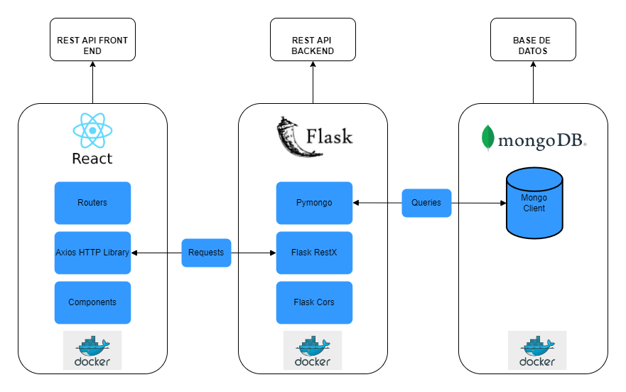
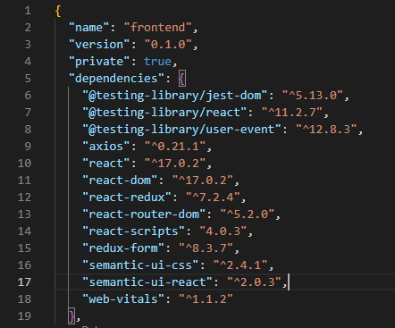

# UCreativa-DevOps-Project  [](https://sonarcloud.io/summary/new_code?id=nabetse28_UCreativa-DevOps-Project)
## Descripcion 

Proyecto en el que se realizara todo el proceso DevOps para el desarrollo y despliegue de una aplicación web con funciones CRUD..
La aplicación consiste en mediante una interfaz gráfica poder crear una ficha de datos de una persona, poder editar los datos y eliminar la ficha en caso de ser requerido. Para acceder al CRUD el usuario primero tendrá que autenticarse en el login con usuario y contraseña, cada persona se compone de las siguientes características: Nombre (Name), Titulo(Background), Edad(Age) y Descripción, la aplicación permite crear, leer, actualizar y borrar los datos.

## Arquitectura de la aplicacion:




## Requerimientos

## Para Planeamiento y control de tareas:

- [Trello](https://trello.com/b/LwVKMl9k/devops-task) Utilizado para organizar tareas mediante la metodología Kanban.

## Para versionamiento y source control management:

- [GitHub](https://github.com/nabetse28/UCreativa-DevOps-Project) Hostea el repositorio donde esta nuestra aplicación.

### Para Backend Development:

- [Python 3.10.0](https://www.python.org/) lenguaje de programación usado para escribir el backend
- [Flask RestX 0.5.1](https://flask-restx.readthedocs.io/en/latest/) extension de Flask usada para crear REST APIs rapidamente.
- [Mongodb 6.0](https://www.mongodb.com/) Base de datos no relacional
- [Docker](https://www.docker.com/) para crear una imagen contenerizada de la aplicacion de python y mongodb.


### Para FrontEnd Development:

- [REACT](https://reactjs.org/) A JavaScript library for building user interfaces.



- [Docker](https://www.docker.com/) para crear una imagenen contenerizada del frontend.


### Para Deployment:

- [Amazon Web Services](https://aws.amazon.com/?nc2=h_lg) servicio de hosting en la nube.

- [GitHubActions](https://docs.github.com/en/actions) la herramienta utilizada para el Pipeline de CI/CD, el pipeline consiste en:

    - 3 jobs:
        - Test & Secure:
            - Instalar dependencias de python
            - Instalar dependencias de node.js
            - Test lint para errores de syntax en el backend con pylint
            - Pruebas de unidad para el backend con pytest
            - Pruebas de unidad para el front end con npm
            - Escaneo de Vulnerabilidades de código con Sonarcloud
        - Build:
            - Logearse a dockerhub para pushear las imagenes
            - construir las imagenes del backend y frontend con el comando docker build.
            - Escaneo de Vulnerabilidades en la imagen del backend con Anchore
            - Escaneo de Vulnerabilidades en la imagen del frontend con Anchore
            - Pushear las imagenes a dockerhub si no hay vulnerabilidades criticas
        - Deploy:
            - Configura las credenciales de AWS
            - Updatea el kube config para poder conectarnos al cluster de AWS
            - Despliega el cluster de kubernetes al servicio de Amazon EKS usando Helm.
            - Nos brinda la IP publica de la aplicacion hosteada en AWS 

- [DockerHub](https://hub.docker.com/) Para almacenar las imagenes que luego seran usadas por el cluster de kubernetes.
- [Kubernetes](https://kubernetes.io/) Herramienta para crear clusters en una máquina virtual usada conjunto a Docker para crear aplicaciones de microservicios 
- [Helm](https://helm.sh/) herramienta para gestionar paquetes de Kubernetes.
- [Amazon EKS](https://docs.aws.amazon.com/eks/latest/userguide/what-is-eks.html) servicio administrado para ejecutar Kubernetes en AWS sin necesidad de instalar, operar ni mantener su propio plano de control o nodos de Kubernetes.


## Para correr la aplicacion instalar dependencias y probar cambios en el app localmente con Docker Compose

1. Anadir el repositorio localmente.
```bash
git clone https://github.com/nabetse28/UCreativa-DevOps-Project.git
```
2. ir al folder del proyecto.
```bash
cd UCreativa-DevOps-Project/
```
3. se nececita un archivo `.env` para poder correr el  `docker-compose`. Crear el archivo `.env` de la siguiente manera:

```bash
cd UCreativa-DevOps-Project/
nano .env
```
Agregar las siguiente variables de entorno dentro del archivo `.env`:
```
MONGO_USER=<YOUR_USER>
MONGO_PASSWORD=<YOUR_PASSWORD>
MONGO_SERVER=mongo_db
```

4. Correr el comando del docker compose para correr toda la aplicacion:

```bash
docker-compose up --build -d
```

5. Una vez el comando corra exitosamente la aplicacion estara disponible localmente en el localhost:8090...

