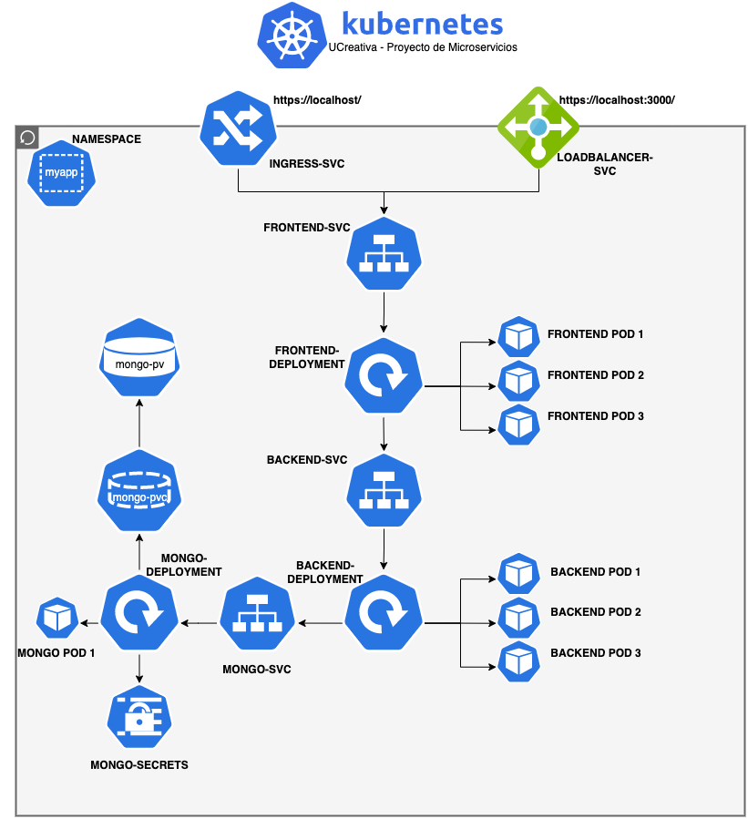

# myapp
## Prerequisites
This app uses different frameworks to be deployed:
- [Python 3.10.2](https://www.python.org/)
- [Docker Desktop 3.6.0 Mac with Apple chip](https://docs.docker.com/desktop/mac/release-notes/3.x/)


## Installation
### Docker Compose
1. To run this project you will need to clone a [frontend project](https://github.com/nabetse28/UC-FundamentosDevOps-FrontEnd) that uses React JS framework. Then, inside the project, change to the `python-flask-test` branch.

```bash
git clone https://github.com/nabetse28/UC-FundamentosDevOps-FrontEnd
```

```bash
cd /UC-FundamentosDevOps-FrontEnd
git checkout python-flask-test
cd ..
```
2. Then, clone this repo in the same path as the early project and get into it.

```bash
git clone git@github.com:nabetse28/python-flask-test.git
```

3. You will need a `.env` file to run the project with `docker-compose`. Create the `.env` file as follows:

```bash
cd /python-flask-test
nano .env
```

Add these lines to your `.env` with your values:
```
MONGO_USER=<YOUR_USER>
MONGO_PASSWORD=<YOUR_PASSWORD>
MONGO_SERVER=mongo_db
```

3. Now, run the following command to run the entire project:

```bash
docker-compose up --build -d
```
NOTE: Make sure to delete the `mongo_db` folder before run this command if the folder is there.
### Kubernetes
1. Enable `k8s` in your `Docker Desktop`.
2. Create a kubernetes [ingress controller](https://kubernetes.github.io/ingress-nginx/deploy/#quick-start) with the following command:

```bash
kubectl apply -f https://raw.githubusercontent.com/kubernetes/ingress-nginx/controller-v1.2.0/deploy/static/provider/cloud/deploy.yaml
```

3. Crete a namespace with the name `myapp`, as follows:

```bash
kubectl create namespace myapp
```

4. Build the docker images for each project and change the name of the image in each `deployment` file.

```bash
docker build -t <docker_username>/<image_name>:<tag> .
```

5. Finally, apply all `k8s` files.

```bash
cd /python-flask-test
kubectl apply -f k8s/
```

## Application Design

